# pho-diff

Visually compare the phonetic inventories of two languages.

# Motivation

When learning a new language, you need to know the new sounds: the ones that aren't a part of your native sound system. I wanted a tool to quickly compare the different sounds of two languages. `pho-diff` presents two languages in the form of a [diff](https://en.wikipedia.org/wiki/Diff_utility) of their [IPA charts](https://www.internationalphoneticassociation.org/content/full-ipa-chart).

For two languages `a` and `b`, if a letter (which represents a distinctive sound) is absent in `b`'s chart but present in `a`'s, it is colored green. Likewise, if a letter is absent in `a` but present in `b`, the letter is colored red (see [Examples](#examples)). `pho-diff` also outputs a Clojure map with additional information (other sounds not on the chart, links to the source URLs, etc.).

`pho-diff` can be useful for second language learners trying to learn pronunciation. While IPA resources are biased for English speakers, `pho-diff` can assist with developing resources for ESL: it can identify sounds from someone's first language that may not exist in English or identify sounds in English that do not exist in someone's native language.

`pho-diff` can diff between two arbitrary languages as long as they're in the [Speech Language Archive](http://accent.gmu.edu/browse_native.php); paired with [other tools](#resources), this can be helpful for languages that have fewer common resources or speakers.

## Example Use Cases

Use `pho-diff` to find the new sounds in the target language (colored green) and use the [Interactive IPA Chart](http://www.ipachart.com/) to hear roughly the sounds that the symbols represent.

### An English speaker learning Spanish

``` bash
lein run "english" "spanish"
```

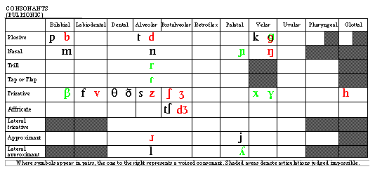
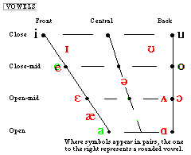

### A Spanish speaker learning English

``` bash
lein run "spanish" "english"
```

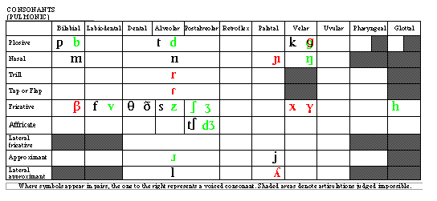
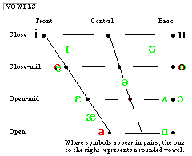

### A Korean speaker learning Esperanto

``` bash
lein run "korean" "esperanto"
```

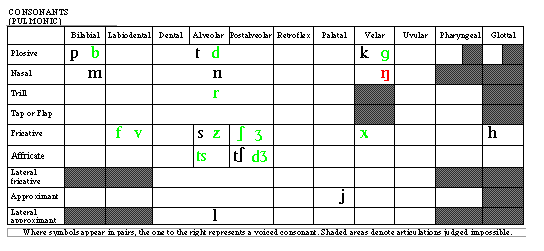
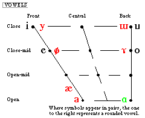

### A German speaker learning Tagalog

``` bash
lein run "german" "tagalog"
```

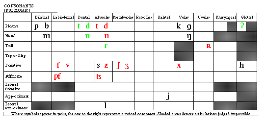
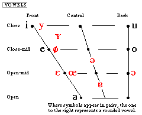

# Resources

  - The [Speech Accent Archive](http://accent.gmu.edu/browse_native.php) provides the set of native language phonetic inventories (you can read more about the project [here](http://accent.gmu.edu/about.php)).
  - [Phonetics, sound inventory (Babylon)](http://lingvo.info/en/babylon/phonetics) — an explanation of phonetics and phonology.
  - [Interactive IPA Chart](http://www.ipachart.com/) — hear the approximant sounds that the symbols represent
  - [Fluent Forever](https://fluent-forever.com/) — a language learning method that emphasizes learning the new sounds of a language and getting the pronunciation right.
  - [American Speech-Language-Hearing Association](https://www.asha.org/practice/multicultural/Phono/) — a curated list of resources for learning the *phonemic* inventories and cultural information across languages.
  - [UCLA Language Materials Project](http://www.lmp.ucla.edu/) — teaching resources for less commonly taught languages.

## Installation

Download from https://github.com/sgepigon/pho-diff.

``` bash
git clone https://github.com/sgepigon/pho-diff.git
```

## Usage

``` bash
lein run "a" "b"
```

`a` and `b` should be languages from the [Speech Accent Archive](http://accent.gmu.edu/browse_native.php). See [Bugs](#bugs) for caveats.

## Examples

``` bash
lein run "english" "tagalog"
```

``` clojure
{:keys [:a "english" :b "tagalog"],
 :charts
 {:cons "resources/output/english-tagalog-cons.gif",
  :vowels "resources/output/english-tagalog-vowels.gif"},
 :other-sounds
 {:a #{"labio-velar voiced central approximant [w]" "5 diphthongs"},
  :b #{"labio-velar central approximant [w]"}},
 :sources
 {:a
  "http://accent.gmu.edu/browse_native.php?function=detail&languageid=18",
  :b
  "http://accent.gmu.edu/browse_native.php?function=detail&languageid=64"}}
```

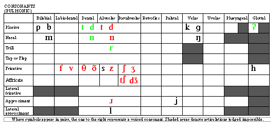


### Bugs

If either languages `a` or `b` lack an IPA chart, `pho-diff` will return `nil`.

Not all languages listed on the [Speech Accent Archive](http://accent.gmu.edu/browse_native.php) have an inventory chart. Instead, the pages say "Coming soon…" e.g. "[malagasy](http://accent.gmu.edu/browse_native.php?function=detail&languageid=314)", "[yapese](http://accent.gmu.edu/browse_native.php?function=detail&languageid=185)", "[sotho](http://accent.gmu.edu/browse_native.php?function=detail&languageid=219)", "[hmong daw](http://accent.gmu.edu/browse_native.php?function=detail&languageid=355)", and "[tamajeq](http://accent.gmu.edu/browse_native.php?function=detail&languageid=209)".

"[newari](http://accent.gmu.edu/browse_native.php?function=detail&languageid=220)" actually does not say "Coming soon…" but it is missing the charts. "newari" points to "[newar](http://accent.gmu.edu/browse_native.php?function=detail&languageid=223)" which does say "Coming soon…"

There are some languages that do have IPA charts, but are slightly off, e.g. "[yupik](http://accent.gmu.edu/browse_native.php?function=detail&languageid=202)", "[mandinka](http://accent.gmu.edu/browse_native.php?function=detail&languageid=240)", and "[swiss german](http://accent.gmu.edu/browse_native.php?function=detail&languageid=197)". This misalignment results in ugly diffs:

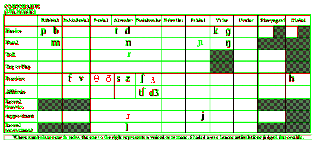
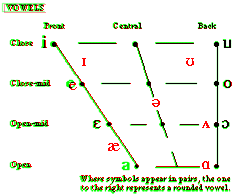

The diff is usable, but still an eyesore.

## Built With

  - [Clojure](https://clojure.org/) – Written in Clojure
  - [ImageMagick](https://www.imagemagick.org/) – Uses the [convert](https://www.imagemagick.org/script/convert.php) program to create the diffs

## License

Copyright © 2017 Santiago Gepigon III

Distributed under the Eclipse Public License either version 1.0 or (at your option) any later version.
